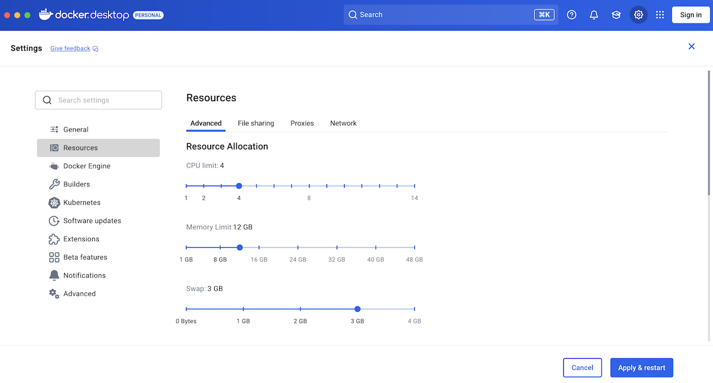

# Solo

[](https://www.npmjs.com/package/@hashgraph/solo)
[](LICENSE)

[](https://github.com/hiero-ledger/solo/actions/workflows/flow-build-application.yaml)
[](https://app.codacy.com/gh/hiero-ledger/solo/dashboard?utm_source=gh\&utm_medium=referral\&utm_content=\&utm_campaign=Badge_grade)
[](https://app.codacy.com/gh/hiero-ledger/solo/dashboard?utm_source=gh\&utm_medium=referral\&utm_content=\&utm_campaign=Badge_coverage)
[](https://codecov.io/gh/hashgraph/solo)
[](https://scorecard.dev/viewer/?uri=github.com/hiero-ledger/solo)
[](https://bestpractices.coreinfrastructure.org/projects/10697)

An opinionated CLI tool to deploy and manage standalone test networks.

## Releases

Solo releases are supported for one month after their release date. Upgrade to the latest version to benefit from new features and improvements. Every quarter a version is designated as LTS (Long-Term Support) and supported for three months.

### Current Releases

| Solo Version | Node.js             | Kind       | Solo Chart | Hedera       | Kubernetes | Kubectl    | Helm    | k9s        | Docker Resources               | Release Date | End of Support |
|--------------|---------------------|------------|------------|--------------|------------|------------|---------|------------|--------------------------------|--------------|----------------|
| 0.59.0       | >= 22.0.0 (lts/jod) | >= v0.29.0 | v0.62.0    | v0.71.0      | >= v1.32.2 | >= v1.32.2 | v3.14.2 | >= v0.27.4 | Memory >= 12GB, CPU cores >= 6 | 2026-02-27   | 2026-03-27     |
| 0.58.0 (LTS) | >= 22.0.0 (lts/jod) | >= v0.29.0 | v0.62.0    | v0.71.0      | >= v1.32.2 | >= v1.32.2 | v3.14.2 | >= v0.27.4 | Memory >= 12GB, CPU cores >= 6 | 2026-02-25   | 2026-05-25     |
| 0.57.0       | >= 22.0.0 (lts/jod) | >= v0.29.0 | v0.60.2    | v0.71.0      | >= v1.32.2 | >= v1.32.2 | v3.14.2 | >= v0.27.4 | Memory >= 12GB, CPU cores >= 6 | 2026-02-19   | 2026-03-19     |
| 0.56.0 (LTS) | >= 22.0.0 (lts/jod) | >= v0.29.0 | v0.60.2    | v0.68.7-rc.1 | >= v1.32.2 | >= v1.32.2 | v3.14.2 | >= v0.27.4 | Memory >= 12GB, CPU cores >= 6 | 2026-02-12   | 2026-05-12     |
| 0.55.0       | >= 22.0.0 (lts/jod) | >= v0.29.0 | v0.60.2    | v0.68.7-rc.1 | >= v1.32.2 | >= v1.32.2 | v3.14.2 | >= v0.27.4 | Memory >= 12GB, CPU cores >= 6 | 2026-02-05   | 2026-03-05     |
| 0.54.0 (LTS) | >= 22.0.0 (lts/jod) | >= v0.29.0 | v0.59.0    | v0.68.6+     | >= v1.32.2 | >= v1.32.2 | v3.14.2 | >= v0.27.4 | Memory >= 12GB, CPU cores >= 6 | 2026-01-27   | 2026-04-27     |
| 0.52.0 (LTS) | >= 22.0.0 (lts/jod) | >= v0.26.0 | v0.58.1    | v0.67.2+     | >= v1.27.3 | >= v1.27.3 | v3.14.2 | >= v0.27.4 | Memory >= 12GB, CPU cores >= 6 | 2025-12-11   | 2026-03-11     |

To see a list of legacy releases, please check the [legacy versions documentation page](docs/legacy-versions.md).

### Hardware Requirements

Docker Desktop (or Docker Engine / Podman on Linux) with at least **12GB of memory** and **6 CPU cores**.



## Installation

Install Solo via Homebrew (macOS, Linux, WSL2):

```bash
brew install hiero-ledger/tools/solo
```

Or via npm (requires Node.js >= 22.0.0):

```bash
npm install -g @hashgraph/solo@latest
```

For detailed platform-specific instructions, see the [Solo User Guide](https://solo.hiero.org/main/docs/solo-user-guide/).

## Documentation
If you have installed solo we recommend starting your docs journey at the one-shot network deployment command you can find here:
[solo docs](https://solo.hiero.org/main/docs/solo-user-guide/#one-shot-deployment))

## Contributing

Contributions are welcome. Please see the [contributing guide](https://github.com/hiero-ledger/.github/blob/main/CONTRIBUTING.md) to see how you can get involved.

## Code of Conduct

This project is governed by the [Contributor Covenant Code of Conduct](https://github.com/hiero-ledger/.github/blob/main/CODE_OF_CONDUCT.md). By participating, you are expected to uphold this code of conduct.

## License

[Apache License 2.0](https://www.apache.org/licenses/LICENSE-2.0)
