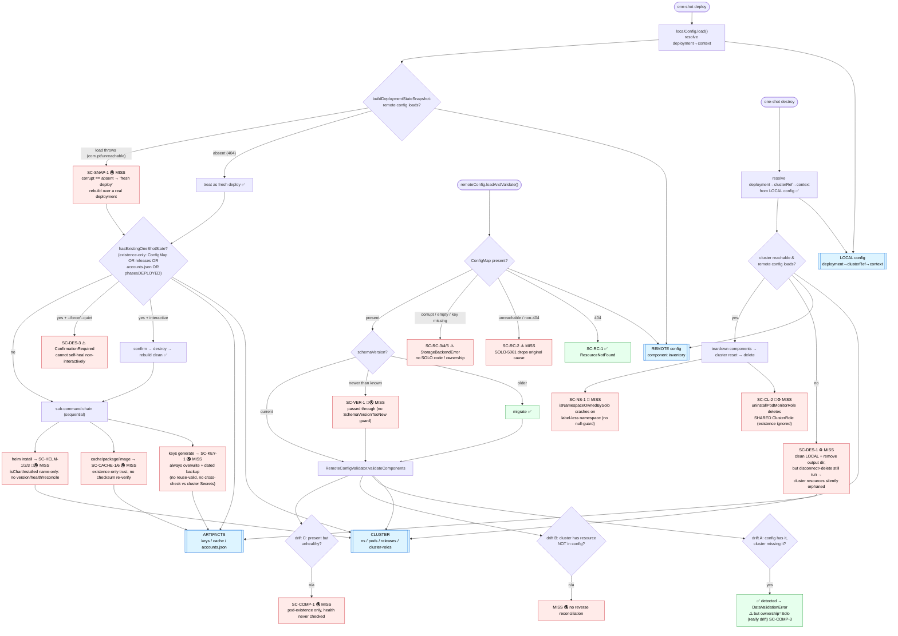

# Config ↔ Cluster ↔ Artifacts — Relationships & Consistency Flow

This document focuses on the **relationships** between the four state layers Solo keeps in sync — **local
config**, **remote config**, the **cluster**, and on-disk **artifacts** — and on **where drift between
them is (and is not) checked**. It is the relationship-centric companion to the check-ordering flows in
[`config-decision-flows.md`](./config-decision-flows.md), the failure catalog in
[`one-shot-config-failure-handling.md`](./one-shot-config-failure-handling.md), and the per-scenario
decision worksheet in [`config-leftover-failure-questionnaire.md`](./config-leftover-failure-questionnaire.md).

It covers the **full lifecycle** — deploy, destroy, and the validation/drift seams shared by both — using
`one-shot single deploy/destroy` as the worked example because it orchestrates nearly every other command.
Every edge is tagged with what exists today vs. what is missing.

> Starting point for team collaboration, not a finished design. `SC-*` IDs map 1:1 to the failure catalog.
> Diagrams are provided in **Mermaid** (diagram-as-code) and an equivalent **plain-text** tree so the
> source can be edited by anyone — or an AI — without a Mermaid renderer.

Legend: ✅ check exists (HAVE) · ⚠️ mislabeled / untyped · 🐛 bug · 🔇 silent-swallow / proceeds on bad
state · ♻️ orphan / leftover · 🔀 cross-version. **MISS** = no check today.

## The four layers and who owns what

The mental model that makes the drift make sense: **each layer owns exactly one job, and every failure
below happens at a seam between two layers.**

| Layer | Owns (source of truth for…) | Stored at | Consistency job |
| --- | --- | --- | --- |
| **Local config** | *How to reach the cluster* — `deployment → clusterRef → context` | `~/.solo/local-config.yaml` | Resolve a deployment name to a kube context |
| **Remote config** | *What should exist* — the component inventory + phases | `solo-remote-config` ConfigMap (in-cluster) | Record intended topology |
| **Cluster** | *What actually exists* — namespaces, pods, helm releases, cluster-scoped roles | Kubernetes API | The live truth |
| **Artifacts** | *Supporting on-disk state* — keys, image/values/package cache, `accounts.json`, `last-one-shot-deployment.txt` | `~/.solo/…` and the one-shot output dir | Feed deploy inputs / prior-state signals |

The four seams (each a section in the HAVE/MISS table further down):

- **Local ↔ Cluster** — can we even find and reach the cluster the deployment names?
- **Remote ↔ Cluster** — does the recorded inventory match the live topology? (drift A / B / C)
- **Artifacts ↔ Cluster/Config** — are the on-disk inputs trustworthy and consistent with the deploy?
- **Cross-consistency** — the high-impact interactions across three or more layers.

## Lifecycle flow (Mermaid)



## Lifecycle flow (plain text)

Node-for-node equivalent of the Mermaid above. `[HAVE]` = check exists, `[MISS]` = no check. `SC-*` ties
to the failure catalog.

```
LAYERS (anchors)
  LOCAL config   = deployment → clusterRef → context      (how to reach the cluster)
  REMOTE config  = component inventory + phases           (what should exist)
  CLUSTER        = namespaces / pods / releases / roles   (what actually exists)
  ARTIFACTS      = keys / cache / accounts.json / txt      (supporting on-disk inputs)

DEPLOY (one-shot)
  1. localConfig.load() → resolve deployment→context .................. touches LOCAL
  2. buildDeploymentStateSnapshot: does remote config load? .......... touches REMOTE
       - absent (404) ............................. treat as fresh deploy          [HAVE]
       - load throws (corrupt / unreachable) ...... SC-SNAP-1 corrupt == absent   [MISS]
                                                     → "fresh deploy" rebuilds over
                                                       a real-but-broken deployment
  3. hasExistingOneShotState? (existence-only: ....... touches CLUSTER + ARTIFACTS [MISS-health]
       ConfigMap OR helm releases OR accounts.json OR any phase ≥ DEPLOYED)
       - yes + interactive ........ confirm → destroy → rebuild clean             [HAVE]
       - yes + --force/--quiet .... SC-DES-3 ConfirmationRequired, no self-heal   [MISS]
       - no ....................... proceed
  4. sub-command chain (sequential):
       - keys generate ............ SC-KEY-1 always overwrite + dated backup;     [MISS]
                                    no reuse-valid; no cross-check vs cluster Secrets
       - cache/package/image ...... SC-CACHE-1/6 existence-only, no checksum      [MISS]
       - helm install ............. SC-HELM-1/2/3 name-only: no version/health    [MISS]
                                    /reconcile → touches CLUSTER

VALIDATE / DRIFT  (remoteConfig.loadAndValidate — shared by deploy & most commands)
  1. ConfigMap present? ............................................. touches REMOTE
       - 404 ...................... SC-RC-1 ResourceNotFound                      [HAVE]
       - unreachable / non-404 .... SC-RC-2 SOLO-5061 drops original cause        [MISS-cause]
       - corrupt/empty/key missing  SC-RC-3/4/5 StorageBackendError, no code      [MISS]
  2. schemaVersion?
       - older ................... migrate                                        [HAVE]
       - newer than known ........ SC-VER-1 silently passed through               [MISS]
                                   (no SchemaVersionTooNew guard exists)
       - current ................. validate
  3. validateComponents vs CLUSTER:
       - drift A (config has it, cluster missing) . DETECTED → DataValidationError[HAVE]
                                                     but ownership=Solo (SC-COMP-3)[MISS-label]
       - drift B (cluster has extra not in config)  no reverse reconciliation     [MISS]
       - drift C (present but unhealthy) .......... pod-existence only (SC-COMP-1) [MISS]

DESTROY (one-shot)
  1. resolve deployment→clusterRef→context from LOCAL config .......... touches LOCAL [HAVE]
  2. cluster reachable & remote config loads? ........ touches CLUSTER + REMOTE
       - no ...................... SC-DES-1 clean LOCAL + remove output dir, but   [MISS]
                                   cluster disconnect + deployment delete STILL run
                                   → cluster resources silently orphaned
       - yes ..................... teardown components → cluster reset → delete
                                     - SC-CL-2 uninstallPodMonitorRole deletes a   [MISS]
                                       SHARED ClusterRole (existence checked, ignored)
                                     - SC-NS-1 isNamespaceOwnedBySolo crashes on a  [MISS]
                                       label-less namespace (no null-guard)
```

## Checks we HAVE vs. checks we MISS — by seam

Every row is verified against current source. `file:line` refers to the tree at time of writing.

### Local config ↔ Cluster
| # | Check | Status | Evidence |
| --- | --- | --- | --- |
| L1 | Missing local config → auto-create empty (never fails on missing) | ✅ HAVE | `local-config-runtime-state.ts:77` |
| L2 | Malformed / empty / unreadable → `RefreshLocalConfigSource` (SOLO-1003) | ✅ HAVE | `local-config-runtime-state.ts:81` |
| L3 | clusterRef→context written (`cluster-ref connect`) and resolved | ✅ HAVE | `cluster/tasks.ts:104`, `remote-config-runtime-state.ts:366` |
| L4 | **Partial / missing top-level keys** (`deployments`, `clusterRefs`) | **MISS** | silently coalesces to empty → later `DeploymentNotFound`; `local-config-schema.ts:47-51`, `local-config.ts:26-39`, no validation in `schema-definition-base.ts:18-31` |
| L5 | **Referential integrity** — deployment `clusters` ⊆ `clusterRefs` keys ⊆ real kube contexts | **MISS** | never checked at load |
| L6 | **SRE bootstrap** — regenerate local config from an existing cluster's remote config | **MISS** | no backing subcommand (`deployment-command-definition.ts:39` says "import" but none exists); `populateClusterReferences` reads remote→memory only, never writes `local-config.yaml` |
| L7 | Schema version constant vs latest migration | 🔀 MISS | `SCHEMA_VERSION = 1` lags latest migration target `2`; fresh configs written at v1 |

### Remote config ↔ Cluster (topology drift)
| # | Check | Status | Evidence |
| --- | --- | --- | --- |
| R1 | ConfigMap 404 → `ResourceNotFound` | ✅ HAVE | `remote-config-runtime-state.ts:329` (note: the SOLO-5001 branch at `:331` is dead code) |
| R2 | Corrupt / empty / missing-key data → `StorageBackendError` | ⚠️ partial | `yaml-config-map-storage-backend.ts:18/22/28` — thrown, but no SOLO code / ownership |
| R3 | **Drift A** — config has component, cluster missing it | ✅ HAVE (mislabeled) | `remote-config-validator.ts:166`; but `DataValidationError` ownership=Solo though cause is drift (SC-COMP-3) |
| R4 | Non-404 / unreachable → **original cause dropped** | **MISS** | SOLO-5061 constructor takes no `cause` — `kubernetes-api-invalid-response-solo-error.ts:16` |
| R5 | **Schema newer than known** → fail-fast | **MISS** | silently passed through; no `SchemaVersionTooNewError` exists — `schema-definition-base.ts:80-91` |
| R6 | **Drift C** — component present but unhealthy | **MISS** | pod-existence only; CrashLoop pod passes — `remote-config-validator.ts:166-170` |
| R7 | **Drift B** — cluster has a Solo resource NOT in config | **MISS** | no reverse reconciliation; validator only iterates recorded components |
| R8 | Cross-cluster config comparison | **MISS** | `remote-config-runtime-state.ts:395` TODO |
| R9 | Non-consensus `STOPPED` handling | ⚠️ MISS | only consensus `STOPPED` skipped; others still require pods — `remote-config-validator.ts:50` |

### Artifacts ↔ Cluster / Config (existence-only trust)
| # | Check | Status | Evidence |
| --- | --- | --- | --- |
| A1 | `keys generate` re-run semantics | 🔇 MISS | always overwrites; keeps **dated backup** (contradicts "no dated backups"); backs up only private-key PEM; no cross-check vs cluster Secrets — `key-manager.ts:469` |
| A2 | Corrupt PEM on load | ⚠️ MISS | raw crypto/parse error, no typed error / regenerate path — `key-manager.ts:221` |
| A3 | Cached package reused | 🔇 MISS | trusted by existence, no checksum re-verify unless `force` — `package-downloader.ts:243` |
| A4 | Image cache archive | 🔇 MISS | existence-only, no digest/integrity check — `image-cache-handler.ts:78` |
| A5 | Helm release match | 🔀🔇 MISS | `isChartInstalled` name-only — no version/health/reconcile — `chart-manager.ts:166` |
| A6 | `accounts.json` / `last-one-shot-deployment.txt` | 🔇 MISS | existence/non-empty only; contents never validated or cross-checked |

### Cross-consistency (highest impact)
| # | Check | Status | Evidence |
| --- | --- | --- | --- |
| C1 | Deploy: **corrupt vs absent** remote config | 🔇 MISS (P0-ish) | both → "fresh deploy" → rebuild over a real deployment — SC-SNAP-1, `default-one-shot-deploy-orchestrator.ts:918-952` |
| C2 | Destroy with unreachable cluster / unloadable remote config | ♻️ MISS | cleans LOCAL + removes output dir, but disconnect + delete still run → cluster orphaned, reported as success — SC-DES-1 |
| C3 | Shared cluster-scoped ClusterRole on destroy | 🐛♻️ MISS | `uninstallPodMonitorRole` deletes shared role (existence checked, result ignored) → breaks other deployments — SC-CL-2, `cluster/tasks.ts:400` |
| C4 | Label-less namespace ownership check | 🐛 MISS | `isNamespaceOwnedBySolo` dereferences `labels` without null-guard → `TypeError` — SC-NS-1, `k8-helper.ts:71` |
| C5 | Deploy "detect prior state → destroy + rebuild clean" | ✅ HAVE | the one strong guarantee — `default-one-shot-deploy-orchestrator.ts:360-416`; also *why* C1 is dangerous (it bypasses this when corrupt looks absent) |

## Priority reading of the gaps

If the team wants a sequencing hint (non-binding), the seams rank roughly:

1. **C1 (SC-SNAP-1)** — silent data-corruption risk on deploy; distinguish absent from corrupt.
2. **C2/C3 (SC-DES-1/CL-2)** — destroy silently orphans or breaks *other* deployments.
3. **L4 + L6** — partial-config silent-empty and the broken SRE bootstrap block core operator workflows.
4. **R4/R5/R6/R7** — drift + diagnostics gaps that make everything above harder to reason about.
5. **A1–A6 + C4** — existence-only artifact trust and the label-less crash; lower blast radius, still real.
