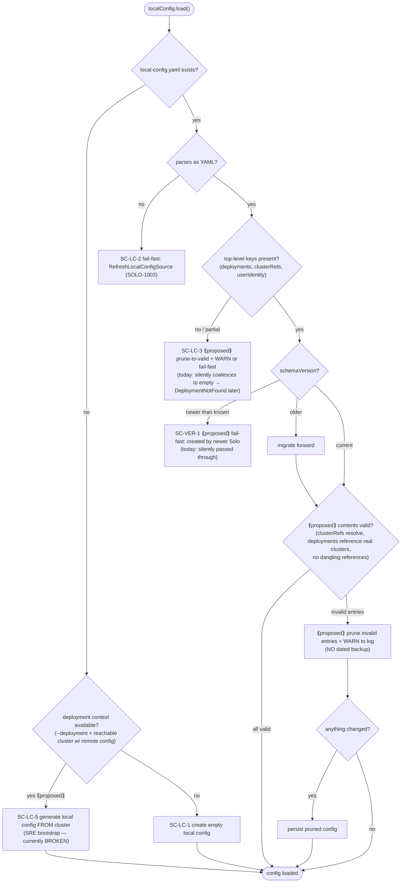
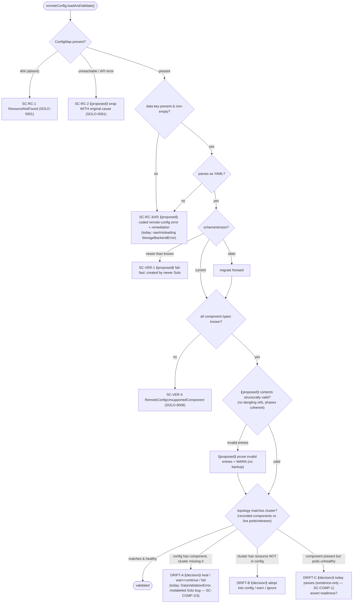

# Config Decision Flows & Goals (local + remote)

Companion to [`one-shot-config-failure-handling.md`](./one-shot-config-failure-handling.md) (the failure
map), [`config-leftover-failure-questionnaire.md`](./config-leftover-failure-questionnaire.md) (the
per-scenario decisions), and
[`config-cluster-artifacts-relationships.md`](./config-cluster-artifacts-relationships.md) (the
relationship/drift view — mermaid + plain text). This doc captures the **goals** for local and remote
configuration and the **decision flow charts** — the order in which things are checked and what happens
at each outcome.

Diagrams are Mermaid (diagram-as-code, embeds in Markdown) so anyone — or an AI — can take the source and
modify it. drawio / SVG are equally acceptable if someone prefers to redraw.

> This is a starting point for a team collaboration, not a finished design. It is fine that some goals are
> hard to implement, and we do **not** have to do everything at once — the flows below mark what is proposed
> vs. what exists today, and the open questions call out what still needs a decision or a ticket.

## Guiding principles

**General**

- Capture hard-to-implement ideas anyway; sequence the work later.
- Prefer a single, well-defined choke point for validation over scattering checks.
- Errors should be actionable (typed `SoloError` + remediation), not raw throws.

**Local config**

- Local config should contain **only valid contents**.
- **Invalid contents are pruned** (removed), not preserved.
- Pruning/repair emits **WARN log messages** describing what was removed and why.
- **No dated backups.** Backups create a maintenance/cleanup burden; we rely on warn logs and the cluster's
  remote config as the recoverable source of truth instead.
- We must define **when** the clean/prune process runs (see the flow + open questions).

**Remote config**

- Remote config should contain **only valid contents**.
- Define **what to do when the live network topology does not match the remote config** (heal / warn / fail),
  per direction of drift.

## Local config — decision flow

Runs when `LocalConfigRuntimeState.load()` is invoked (today: the `initSystemFiles` middleware on every
command, plus explicit calls in deployment/one-shot commands). `⟪proposed⟫` marks target behavior that does
not exist yet.

### When should clean/prune run? (open decision)

Options, to decide as a team:

1. **On every `load()`** — single choke point; every command benefits. Simplest, but silently mutates the
   file on read (surprising; also means concurrent commands may race to persist). *(Suggested starting
   point: validate + WARN on every load; only prune-and-persist on load.)*
2. **On write/persist only** — validate before saving; never mutate on pure reads.
3. **On explicit maintenance** — a supported `solo deployment config prune` (and/or `init`) command; load
   only warns.

### SRE bootstrap (SC-LC-5) — supported today? No.

Goal: a Hashsphere SRE with **no local config** must have a documented, supported way to connect to an
existing Solo network in a cloud cluster and have their local config generated from that cluster (deployment
name, namespace, and clusterRef → context mapping reconstructed from the remote-config ConfigMap + kube
context). **This flow is currently broken.** Likely needs a dedicated command (e.g.
`solo deployment config import --deployment <name> --context <ctx>`) — **file a ticket if one does not
already exist.**

## Remote config — decision flow

Runs in `RemoteConfigRuntimeState.loadAndValidate()`. `⟪proposed⟫` marks target behavior.

### Topology-vs-config mismatch (open decision)

Decide the desired behavior per direction of drift — captured as scenarios in the questionnaire:

- **DRIFT-A** (config says it exists, cluster doesn't): today throws `DataValidationError` owned by "Solo"
  even though the cause is user/cluster drift (SC-COMP-2, SC-COMP-3). Decide: heal the remote config (prune
  the entry), warn+continue, or fail-fast with drift-oriented remediation.
- **DRIFT-B** (cluster has a Solo resource not recorded in config): today largely unnoticed. Decide: adopt
  into config, warn, or ignore.
- **DRIFT-C** (recorded + present but unhealthy): today passes because the validator checks pod *existence*
  only (SC-COMP-1). Decide whether validation should assert readiness/health.

## Open questions / tickets to file

- **When does local-config prune run?** (choke-point decision above.)
- **SRE bootstrap** (`SC-LC-5`): confirm/file a ticket for a supported "generate local config from an
  existing cloud cluster" command; document the flow.
- **Prune semantics:** confirm "prune + WARN, no dated backup" as the standard for both local and remote
  config (note: `keys generate` currently *does* keep timestamped backups — SC-KEY-1 — reconcile against
  the no-backup principle).
- **Topology reconciliation direction(s)** to support (DRIFT-A/B/C) and their priorities.
- **Validity definition:** enumerate exactly what "valid contents" means for each config (required keys,
  reference resolution, phase coherence) so prune/validation is well-specified.
