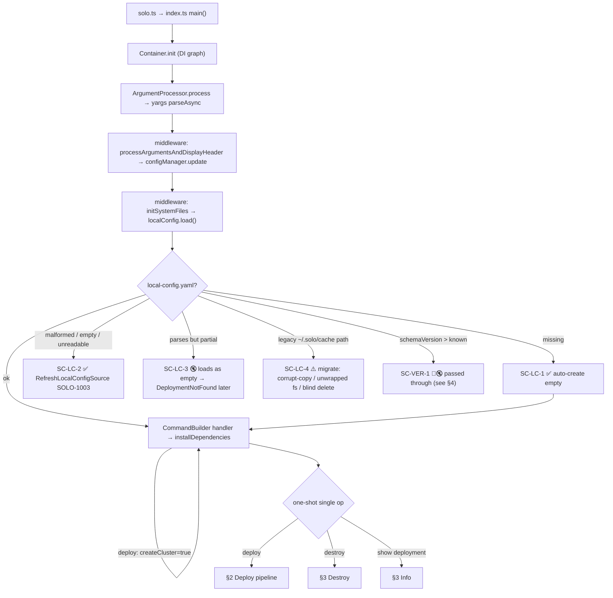
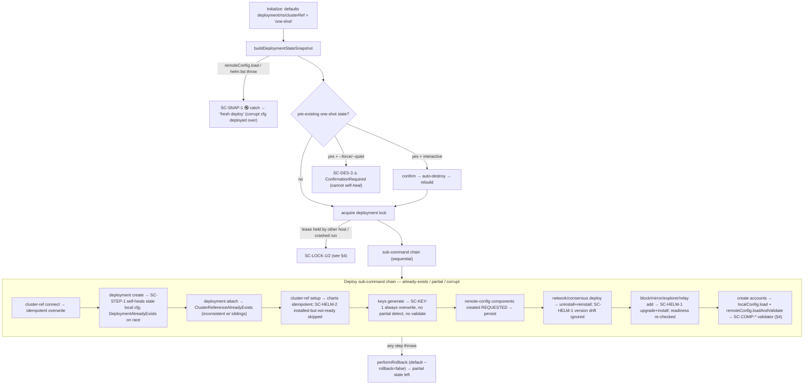
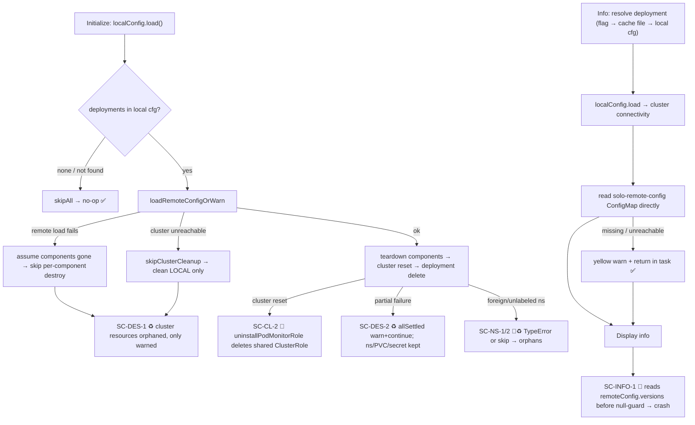
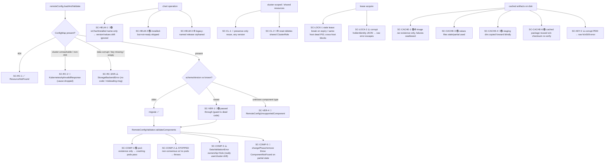

# Config & Leftover-Artifact Failure Map (one-shot as worked example)

> **How to read this doc.** This is the **failure map / catalog** — the first of three linked docs that
> go *map → decisions → design*:
>
> 1. **This doc** — *where* things break. Every failure gets a scenario ID (`SC-*`), a `file:line`, and a
>    legend symbol. Use it to locate a failure and jump to the code.
> 2. [`config-cluster-artifacts-relationships.md`](./config-cluster-artifacts-relationships.md) — the
>    *relationship/drift view* (mermaid + plain text): the same `SC-*` failures organized by the seam
>    between local config, remote config, cluster, and artifacts, with checks-we-have vs checks-we-miss.
> 3. [`config-decision-flows.md`](./config-decision-flows.md) — the *goals + decision flowcharts* that
>    become the implementation.
>
> A fourth doc, [`config-leftover-failure-questionnaire.md`](./config-leftover-failure-questionnaire.md),
> is the per-scenario decision worksheet — **deferred for now**, kept as reference.

This document traces where Solo can fail due to **missing, corrupted, partial, or stale** local/remote
configuration and **leftover artifacts or components** from a previous run or an older Solo version. It uses
the `one-shot single` commands (`deploy`, `destroy`, `show deployment`/info) as the worked example because
they orchestrate almost every other command (deployment, cluster, node, network, block, mirror, relay,
explorer) — but the decision points generalize to all Solo commands.

It is a **map for a design decision**, not an implementation. Each failure carries a scenario ID
(`SC-*`) that maps 1:1 to the [scenario catalog](#scenario-catalog) below and to a decision block in
[`config-leftover-failure-questionnaire.md`](./config-leftover-failure-questionnaire.md). The agreed
**goals** and the proposed **local/remote config check-order flow charts** live in
[`config-decision-flows.md`](./config-decision-flows.md).

Legend: ✅ acceptable today · 🐛 bug · 🔇 silent-swallow / proceeds on bad state · ♻️ orphan / leftover ·
🔀 cross-version · ⚠️ mislabeled / untyped error.

## Contents

- [1. Shared entry spine](#1-shared-entry-spine)
- [2. Deploy pipeline](#2-one-shot-single-deploy-pipeline)
- [3. Destroy & Info](#3-one-shot-single-destroy--show-deployment)
- [4. Generalized config/leftover decision points](#4-generalized-configleftover-decision-points-all-commands)
- [5. Scenario catalog](#scenario-catalog)

## 1. Shared entry spine

Runs for every command. Local config is created/loaded in the `initSystemFiles` middleware *before* any
command handler.

## 2. one-shot single deploy pipeline

Deploy first **snapshots** existing state and (interactively) auto-cleans it, then walks the sub-command
chain. The snapshot is the highest-impact silent-corruption path.

## 3. one-shot single destroy & show deployment

## 4. Generalized config/leftover decision points (all commands)

These checkpoints are shared by every command that loads config or touches cluster/Helm state — the same
decisions apply well beyond one-shot.

## Scenario catalog

Every ID here has a node above and a decision block in the questionnaire.

| ID | Area | Now | Where (`file:line`) | Current behavior |
| --- | --- | --- | --- | --- |
| SC-ENTRY-1 | bootstrap | ⚠️ | `file-storage-backend.ts:31` | `~/.solo` missing at DI construct → raw `StorageBackendError` |
| SC-LC-1 | local cfg | ✅ | `local-config-runtime-state.ts:77` | missing → auto-create empty |
| SC-LC-2 | local cfg | ✅ | `local-config-runtime-state.ts:85` | malformed/empty/unreadable → `RefreshLocalConfigSource` (SOLO-1003) |
| SC-LC-3 | local cfg | 🔇 | `local-config.ts:24-40,58` | parseable-but-partial → silently empty → `DeploymentNotFound` later |
| SC-LC-4 | local cfg | ⚠️ | `local-config-runtime-state.ts:62-74` | legacy-path migration: corrupt copy / unwrapped fs / blind delete |
| SC-LC-5 | local cfg | 🐛 | (no supported command) | SRE with no local config cannot generate one from an existing cloud cluster — flow broken |
| SC-RC-1 | remote cfg | ✅ | `remote-config-runtime-state.ts:331` | ConfigMap 404 → `ResourceNotFound` (SOLO-5001) |
| SC-RC-2 | remote cfg | 🐛 | `remote-config-runtime-state.ts:329` | unreachable/non-404 → SOLO-5061, original cause dropped |
| SC-RC-3 | remote cfg | ⚠️ | `yaml-config-map-storage-backend.ts:25` | corrupt `remote-config-data` YAML → raw `StorageBackendError`, no code |
| SC-RC-4 | remote cfg | ⚠️ | `config-map-storage-backend.ts:66` | data present, key missing → misleading "error reading config map" |
| SC-RC-5 | remote cfg | ⚠️ | `yaml-config-map-storage-backend.ts:21` | empty-string value → `StorageBackendError('data is empty')` |
| SC-VER-1 | cross-version | 🔀🔇 | `schema-definition-base.ts:80-91` | schemaVersion newer than known → silently passed through; guard is dead code |
| SC-VER-2 | cross-version | ✅ | `upgrade-version-guard.ts:7` | downgrade attempt → `VersionDowngradeBlocked` (SOLO-4040) |
| SC-VER-3 | cross-version | 🔀 | `remote-config-runtime-state.ts:226` | schema created at v6, migrations to v8, `SCHEMA_VERSION` const=1 — reconcile |
| SC-VER-4 | cross-version | 🔀 | `remote-config-runtime-state.ts:481` | unknown component type → `RemoteConfigUnsupportedComponent` (SOLO-9008) |
| SC-KEY-1 | keys | 🔇 | `key-manager.ts:469-541` | `keys generate` always overwrites, no partial detect, no validate |
| SC-KEY-2 | keys | ⚠️ | `key-manager.ts:221-274` | corrupt/missing PEM on load → raw fs/x509 error, no `SoloError` |
| SC-CACHE-1 | cache | 🔇♻️ | `image-cache-handler.ts:83-127` | image `.tar` existence-only; corrupt loaded blindly; failures swallowed |
| SC-CACHE-2 | cache | 🔀 | `file-system-cache-catalog-store.ts:30` | catalog `soloVersion` unused; reuse-by-`name:version` is correct — non-issue |
| SC-CACHE-3 | cache | 🔇 | `deploy-orchestrator.ts:208,302,877` | `SOLO_VALUES_DIR` values files stale/partial used unvalidated |
| SC-CACHE-4 | cache | 🔀🔇 | `local-config-runtime-state.ts:97-125` | version staging dirs copied forward `cpSync force`, trusted |
| SC-CACHE-5 | cache | 🔇 | `deploy-orchestrator.ts:899-945` | `accounts.json` existence-only signal; contents unvalidated |
| SC-CACHE-6 | cache | 🔇 | `package-downloader.ts:243` | cached package reused by existence, no checksum re-verify |
| SC-CACHE-7 | cache | ⚠️ | `default-one-shot.ts:374` | `last-one-shot-deployment.txt` stale name used as-is |
| SC-LOCK-1 | lock | ✅⚠️ | `interval-lock.ts:137-190` | stale lease broken on expiry/same-host dead PID; cross-host blocks (no `--force-unlock`) |
| SC-LOCK-2 | lock | ⚠️ | `lock-holder.ts:194` | corrupt `holderIdentity` JSON → raw error escapes acquire/release |
| SC-HELM-1 | helm | 🔀🔇 | `chart-manager.ts:133,165` | `isChartInstalled` name-only → version/values drift ignored on install |
| SC-HELM-2 | helm | 🔇 | `chart-manager.ts:120-164` | installed-but-not-ready skipped; broken release persists |
| SC-HELM-3 | helm | ♻️ | `chart-manager.ts:165` | differently-named legacy release neither reused nor uninstalled |
| SC-HELM-4 | helm | ⚠️ | `chart-manager.ts:87-102` | repo URL mismatch only logged |
| SC-CL-1 | cluster shared | 🔀 | `cluster/tasks.ts`, `network.ts:1134`, `explorer.ts:315` | shared cluster-scoped resources reused by presence, any version |
| SC-CL-2 | cluster shared | 🐛♻️ | `cluster/tasks.ts:400` | `uninstallPodMonitorRole` unconditionally deletes shared ClusterRole |
| SC-COMP-1 | component | 🔇 | `remote-config-validator.ts:120-175` | validator checks pod existence only → crashing pods pass |
| SC-COMP-2 | component | ⚠️ | `remote-config-validator.ts:42-52` | `STOPPED` non-consensus w/ no pods → throws |
| SC-COMP-3 | component | ⚠️ | `remote-config-validator.ts:178` | `DataValidationError` ownership=Solo though real cause is drift |
| SC-COMP-4 | component | 🔇 | `remote-config-runtime-state.ts:748` | `getComponentPhasesMap` uses MIN phase → one lagging comp drags type |
| SC-COMP-5 | component | 🐛 | `components-data-wrapper.ts:86,104` | changePhase/remove throw `ComponentNotFound` on partial state |
| SC-COMP-6 | component | 🔇 | orchestrator `:536-624` | interrupted deploy leaves comps at `REQUESTED` (validator ignores) |
| SC-NS-1 | namespace | 🐛 | `k8-helper.ts:71` | `isNamespaceOwnedBySolo` no null-guard → `TypeError` on label-less ns |
| SC-NS-2 | namespace | ♻️ | `default-one-shot.ts:239`, `network.ts:1022` | foreign/unlabeled ns skipped on destroy → orphans |
| SC-DES-1 | destroy | ♻️ | `one-shot-destroy-orchestrator.ts:340-372` | unreachable/unloadable → local-only clean, cluster orphaned (warn only) |
| SC-DES-2 | destroy | ♻️ | `network.ts:1074` | partial destroy warn+continue; ns/PVC/secret kept unless flags+owned |
| SC-DES-3 | destroy | ⚠️ | `deploy-orchestrator.ts:366` | deploy over pre-existing state under `--force`/`--quiet` refuses |
| SC-SNAP-1 | snapshot | 🔇 | `deploy-orchestrator.ts:918-945` | snapshot swallows corrupt remote cfg → deploys over it as "fresh" |
| SC-INFO-1 | info | 🐛 | `default-one-shot.ts:527` | reads `remoteConfig.versions` before null-guard → crash |
| SC-STEP-1 | step policy | ⚠️ | `deployment.ts:874` | `deployment attach` throws already-exists while siblings are idempotent |
| SC-RAW-1 | error hygiene | ⚠️ | `network.ts:1211`, `explorer.ts:277` | raw `throw new Error` on-path (CRD download, cert-manager) |
